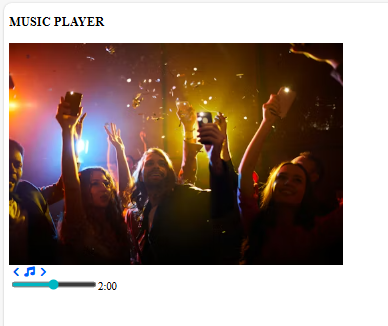

# 🎵 Music Player (HTML Project)

This is a simple static **Music Player UI** created using HTML and Font Awesome icons. It displays a music player layout with an image, control icons, and a progress range slider.

## 📁 Project Structure

```
music-player/
│
├── index.html
└── README.md
```

## 🚀 Features

* Music player title
* Album/party image display
* Previous, music, and next control icons
* Progress bar using range input
* Responsive meta viewport setup
* Font Awesome icons via CDN


[live](https://jishnusmanoj2004-gif.github.io/music-player/)




## 🛠 Technologies Used

* HTML5
* Font Awesome (Icons CDN)
* Basic form input (range slider)

## 📷 Preview

The page shows:

* A heading: **MUSIC PLAYER**
* An image from Unsplash
* Control icons (Previous, Music, Next)
* A progress slider with time display

## 📌 How to Use

1. Download or clone this project.
2. Open `index.html` in any web browser.
3. You will see the music player UI.

## 🔧 Future Improvements (Optional)

* Add real audio playback using `<audio>` tag
* Add CSS for better styling
* Add JavaScript for play/pause and progress control
* Make it fully responsive

## 📄 License

This project is free to use for learning and personal projects.

---


